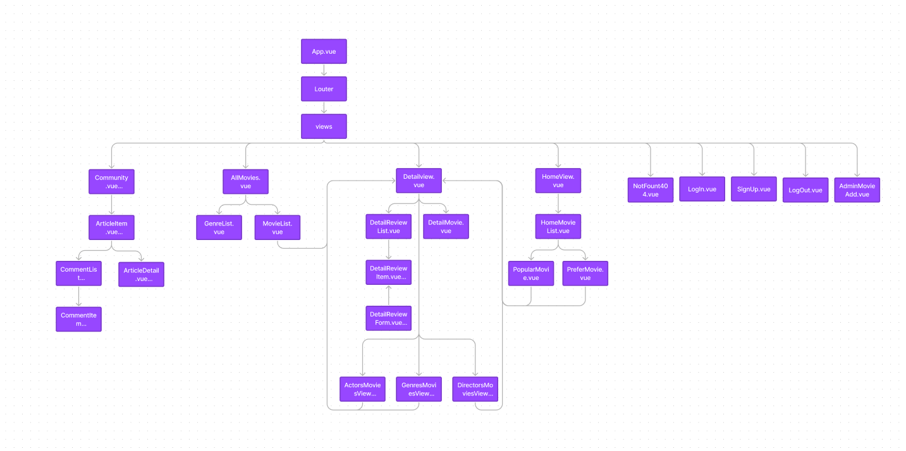

# :shirt: 팀원 정보 및 업무 분담 내역

정예원 : BackEnd 담당. Django Rest Framework를 이용하여 서버를 담당하였습니다. 모델링을 한 후 그에 맞는 영화 데이터를 제공 및 응답하였습니다. css를 조금 적용하였습니다.

임완택: FrontEnd 담당, Vue.js를 이용해 데이터를 활용한 서비스 구현했습니다. TailwindCss를 이용해서 css를 적용시켰습니다.

# :heartpulse: 목표 서비스 구현 및 실제 구현 정도

## :zap: 목표 서비스

주요 테마는 처음에는 깔끔, 모던, 보라색 정도로 생각했었습니다. 편하게 사용자가 사용할 수 있도록 UI를 구성해보는게 목표였습니다. 이후에는 그러기 위해서 서버에서 보내주는 데이터가 중요하다는 것을 깨달았습니다.

## :shopping_cart: 필수 요구사항 구현 

* 관리자 뷰
* 영화 정보
* 영화 추천 알고리즘 - 사용자가 선호하는 장르를 선택하면, 각 장르별로 평점순의 영화를 제공하는 기능을 생각하였습니다
* 커뮤니티

* 장르, 감독, 배우에 따른 영화 리스트 제공과 영화를 제공하는 실제 플랫폼으로 이동할 수 있는 기능을 생각하였습니다.

# :rice_scene: 실제 구현 정도

필수 요구사항

* 관리자 뷰 :  등록 및 삭제는 Django admin 기능을 이용하여 구현 하였고, 수정은 아직 구현하지 못했습니다.

* 영화 정보 : 영화 데이터 약 800개 구성 및 로그인 된 유저가 평점 등록 / 수정 / 삭제 할 수 있습니다.

* 영화 추천 알고리즘 : 선호 장르가 입력된 유저의 데이터베이스가 들어온 경우, 홈 화면에서 선호하는 장르의 영화를 보여줄 수있습니다. 또한 사이트내에서 매긴 평점 순으로 인겨 영화를 제공합니다.

* 커뮤니티 : 해당 영화에 바로 리뷰를 쓸 수 있는 기능과, 따로 커뮤니티를 이용하여 쓸 수 있는 기능, 두가지를 구현하였습니다. 로그인 사용자만이 조회, 생성 할 수 있으며 작성자 본인만 글을 수정 / 삭제할 수 있습니다. 각 게시글은 생성 및 수정 시각 정보가 포함되어 있습니다.

* 감독, 배우, 장르에 따른 영화 데이터 및 페이지 구현 완료하였습니다.

* 영화를 제공하는 플랫폼이 실제로 존재한다면 이동하도록 구현 완료하였습니다.

* 여기에 CSS를 tailwind css를 이용하여 커뮤니티에서 게시글에 좋아요를 누를 때, 아이콘 변화를 시키고 싶었는데 아직 구현하지 못했습니다.

  

# :date: 데이터베이스 모델링(ERD)

총 3개의 app(accounts, articles, movies)을 작성하여 Django를 시작하였습니다.

주요 모델인 Movie 모델을 보면, Director, Actor, Genre와 M:N 관계를 가집니다. 또한 영화에 대한 Review 모델은 Movie를 ForeignKey로 가집니다. 영화를 실제로 제공하는 플랫폼에 대하여 사이트의 이름인 Serieson과 Google 모델은 movie_id를 ForeignKey로 가지는 1:N 관계입니다.

User 모델에서 보면, Review는 작성자인 user와 1:N 관계로 ForeignKey를 가지고, Article 모델과 Comment 모델과도 1:N 관계를 가지는데, Article 모델과는 좋아요를 누른 사람에 대한 관계에서 M:N 관계 또한 가집니다. 영화 추천을 위한 장르를 담은 Recommendation 모델은 User와 N:M 관계를 가집니다. 

Article 모델과 Comment 모델은, Comment가 1: N 관계로 ForeignKey를 가지게 됩니다.

# :dancer: 컴포넌트 트리와 UI/UX

첫 프로젝트이다 보니 감을 못 잡고 UL를 설계해서 엉망이었습니다.

컴포넌트 트리도 처음 생각했던 것과 달라졌습니다. 실제로 구현하다보니 필요에 따라 추가/삭제했습니다.

# :yellow_heart:실제 구현화면

## 홈화면

## 영화 상세정보

배우, 감독, 장르를 누르면 해당하는 정보와 맞는 영화 목록으로 이동합니다. 만약 해당 영화가 플랫폼에 있다면 해당 아이콘이 출력되고 클릭하면 아이콘 회사로 영화를 보러 갈 수 있습니다.

## 영화 목록

## Community

# :facepunch: 느낀점 

:shaved_ice: 정예원 : SSAFY에서 한학기동안 배웠던 모든 내용을 모두 사용하여 하나의 프로젝트를 완성할 수 있었습니다. 그동안 많은 관통프로젝트가 있었고, 거기서 좌절도 하고 많이 배우기도 했지만, 이번만큼 처음부터 끝까지 내가 기획하고 코드를 구성하고 데이터를 수집한 경험은 없었기 때문에, 더욱 뜻깊었습니다. 그동안 개인적으로 토이 프로젝트를 해보라는 말을 많이 들었는데, 수업내용만 따라가기 벅차거나 하기 싫어서 미루던 것을 후회하는 시간이기도 했습니다. 이번 관통프로젝트가 끝난 후에 개인적으로 토이프로젝트를 하나 완성시키리라고 다짐했습니다. 그래도 알고리즘을 짜서 함수를 만들고, 바로 적용하여 페이지가 만들어지는 기쁨을 만끽할 수 있었습니다.

또한 가장 크게 알게된 것은, Backend와 Frontend에 대하여 많이 들어왔지만, 체감을 못하고 있었는데, 이번 프로젝트로 인해 둘의 역할이 무엇이며, 어떤 기능을 담당하는지 알 수 있는 좋은 기회였습니다.

아쉬운 점이 많이 남았고, 좋은 동료를 만나 팀원에게 고맙고 미안한 마음을 가지고 서로 윈윈할 수 있었던 것 같습니다. 관통프로젝트 제출은 끝나더라도, 아쉬운 부분의 개발을 완료하기로 팀원과 다짐하였습니다.

:fireworks:임완택: 

1. git이 중요하다는 것을 깨달았습니다. 
2. 백엔드와 프론트엔드 역할이 이해가 잘 안됐는데 이해가 됐습니다.
3. 기획을 할 때 생각한대로 됐으면 좋았겠지만 많은 오류와 실수 때문에 생각대로 안됐습니다. 
4. 백엔드 팀원이 데이터를 잘 뿌려줘서 편했습니다.
5. 며칠 동안 한 프로젝트에 팀원과 집중하면서 열시간을 넘게 앉아서  뭘 한게 처음입니다. 너무 좋은 경험이었습니다.
